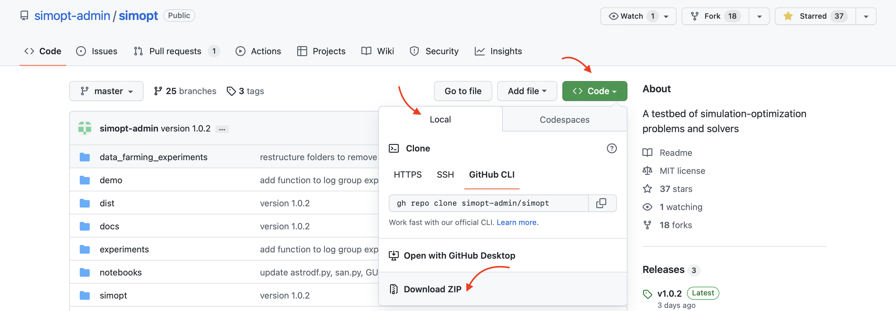

# Welcome to 2023 Winter Simulation Conference SimOpt Workshop!

The SimOpt Workshop is taking place in-person in Conference Room 14 on Sunday, December 10 from 9am-noon.

SimOpt is a testbed of simulation-optimization problems and solvers. Its purpose is to encourage the development and constructive comparison of simulation-optimization (SO) solvers (algorithms). We are particularly interested in the finite-time performance of solvers, rather than the asymptotic results that one often finds in related literature.

The most-up-to-date publication about this library is [Eckman et al. (2023)](https://pubsonline.informs.org/doi/10.1287/ijoc.2023.1273).

## Before Workshop
Before attending the workshop please follow the instructions below:

1. Check to see if you have a python interpreter (with `ipykernel` for Jupyter notebooks) installed.
* Linux/macOS: open a Terminal Window and type the following command:
`python3 --version`
If you see something like
`Python 3.6.13 :: Anaconda custom (x86_64)`
then you have python installed. If you get a message like
`Command not found`
then you don’t.
* Windows: open a command prompt and run the following command:
`py -3 --version`

2. If you don’t have a python interpreter installed, then download from [Anaconda](https://www.anaconda.com/products/distribution). Anaconda provides not just a Python interpreter, but many useful libraries and tools for data science.

3. Install [VS Code](https://code.visualstudio.com).

4. Next, install the [Python extension for VS Code](https://marketplace.visualstudio.com/items?itemName=ms-python.python) from the Visual Studio Marketplace.

5. To work with Python in Jupyter Notebooks, you must activate an Anaconda environment in VS Code, or another Python environment in which you've installed the [Jupyter package](https://pypi.org/project/jupyter/). To select an environment, use the **Python: Select Interpreter** command from the Command Palette `(⇧⌘P)`.

6. On your local hard drive, create a folder simopt-folder somewhere convenient.

7. In VSCode, go to the File menu and select “Open Folder…” and open the folder you created. That folder will become your VSCode workspace.

8. Test the python interpreter:
* In the Explorer panel of VSCode editor click on the New File icon, and type `hello.py`.

* In the new file in the next panel, type
  * `msg = "Hello World"`
  * `print(msg)`
* Hit run (the triangular play button) at the top right corner of the file.


9. Test the jupyter interpreter:
* In the VS Code editor, click on the add new file icon, and type `hello.ipynb`.
* In the new notebook file, type
  * `msg = "Hello World"`
  * `print(msg)`
* Hit run icon  on the left side of the block in the notebook.

* You may get a dialog box asking you to install the ipykernel for python notebooks. If so, then perform the following step (recall Step 5), but otherwise, go on to Step 10 below.
  * From within VSCode, select the python interpreter on the top-right corner of the panel that looks like  and from the list of available interpreters in your local computer, select the one that says Conda on the right.
  * Select a Python 3 interpreter by opening the Command Palette (Ctrl+Shift+P or Command+Shift+P), start typing the Python: Select Interpreter command to search, then select that command.

(There will an opportunity to do these last two steps during the workshop, but you can also attempt them beforehand.)

10. Open a terminal inside VSCode by clicking on Terminal > New Terminal from the menu. Inside the terminal, type the following to create a virtual environment: 
    * `python -m venv venv`
    * `venv\Scripts\activate` or on a Mac, `source venv/bin/activate`

  * Then run the following commands to install the simopt package and open the GUI.
    * `python -m pip install simoptlib`
    * `python -m simopt.GUI`

  * A pop-up window with the GUI should open. You can close it.

11. In your browser, navigate to [https://github.com/simopt-admin/simopt](https://github.com/simopt-admin/simopt). Click on "Download ZIP" as shown.


    
Unzip the folder **simopt-master** and open it in VS Code using `File > Open Folder`.

Open the file `workshop/workshop.ipynb` in the VS Code editor and follow along.


## Admins
The core development team currently consists of

- [**David Eckman**](https://eckman.engr.tamu.edu) (Texas A&M University)
- [**Sara Shashaani**](https://shashaani.wordpress.ncsu.edu) (North Carolina State University)
- [**Shane Henderson**](https://people.orie.cornell.edu/shane/) (Cornell University)


## Citation
To cite this work, please use
```
@misc{simoptgithub,
  author = {D. J. Eckman and S. G. Henderson and S. Shashaani and R. Pasupathy},
  title = {{SimOpt}},
  year = {2023},
  publisher = {GitHub},
  journal = {GitHub repository},
  howpublished = {\url{https://github.com/simopt-admin/simopt}},
  commit = {4c5de2e7576a596ea20979636cb034e75fada3f4}
}
```

## Acknowledgments
An earlier website for SimOpt, [http://www.simopt.org](http://www.simopt.org), was developed through work supported by the National Science Foundation under grant nos. DMI-0400287, CMMI-0800688 and CMMI-1200315.
Recent work on the development of SimOpt has been supported by the National Science Foundation under grant nos. DGE-1650441, CMMI-1537394, CMMI-1254298, CMMI-1536895, CMMI-2226347, CMMI-2206972, CMMI-2035086, IIS-1247696, and TRIPODS+X DMS-1839346, by the Air Force Office of Scientific Research under grant nos. FA9550-12-1-0200, FA9550-15-1-0038, and FA9550-16-1-0046, and by the Army Research Office under grant no. W911NF-17-1-0094.
Any opinions, findings and conclusions or recommendations expressed in this material are those of the authors and do not necessarily reflect the views of the National Science Foundation (NSF).
